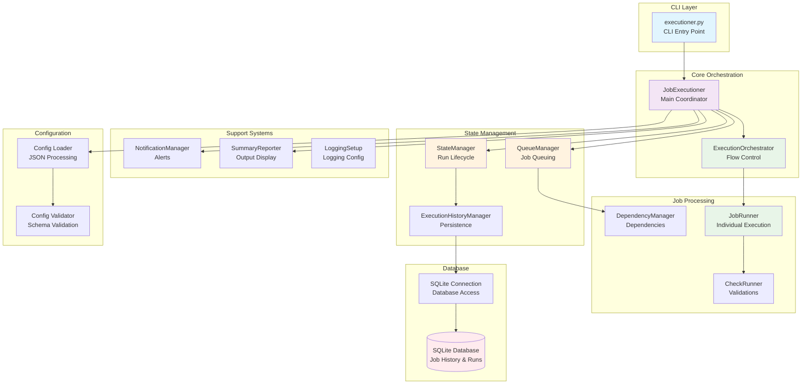
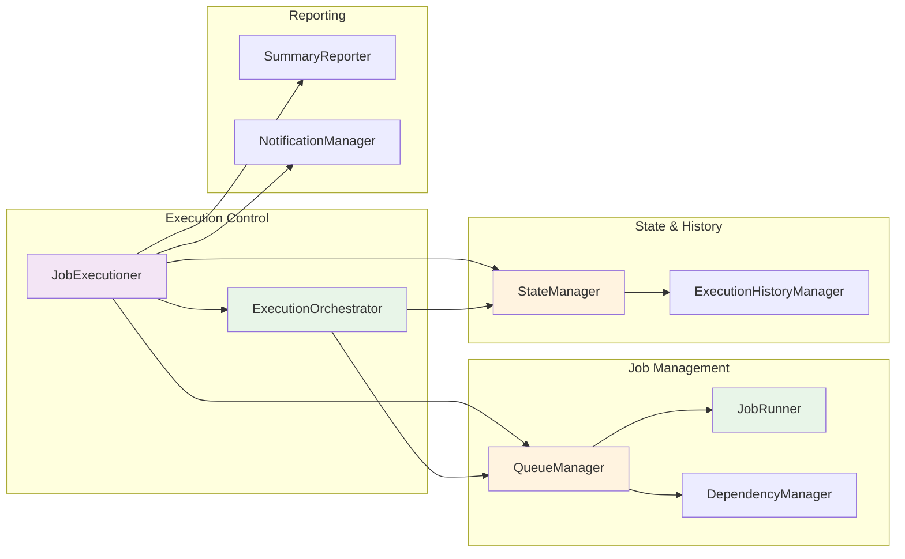
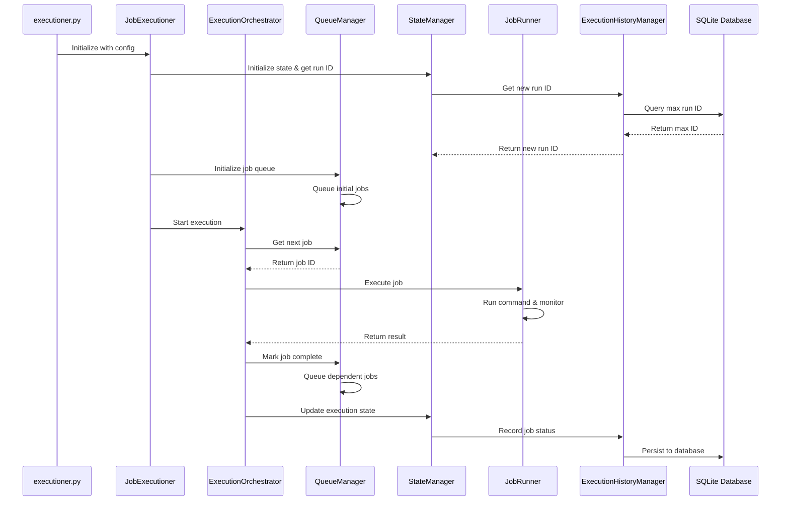
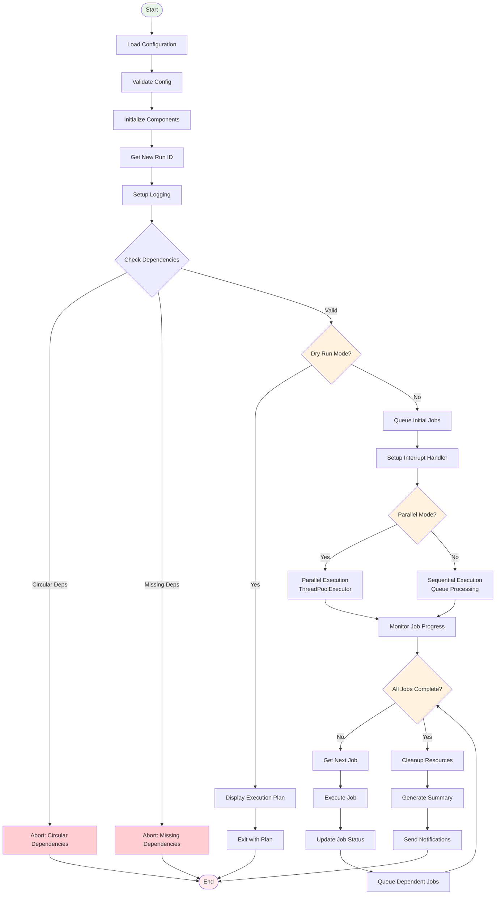
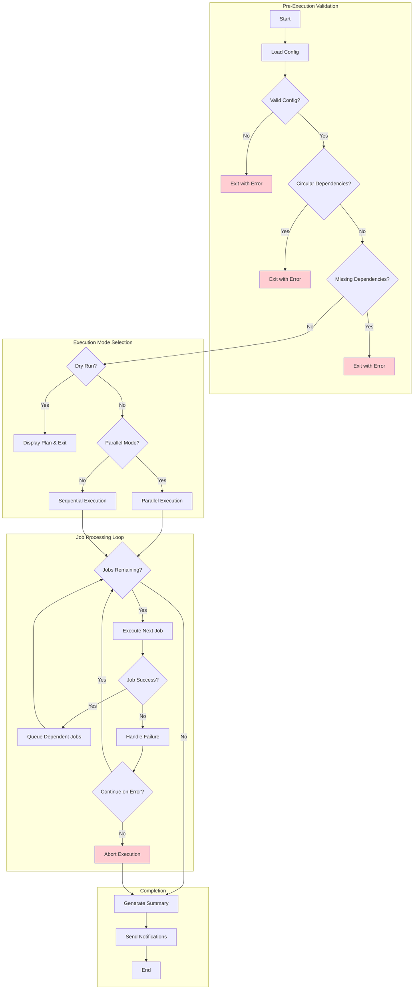
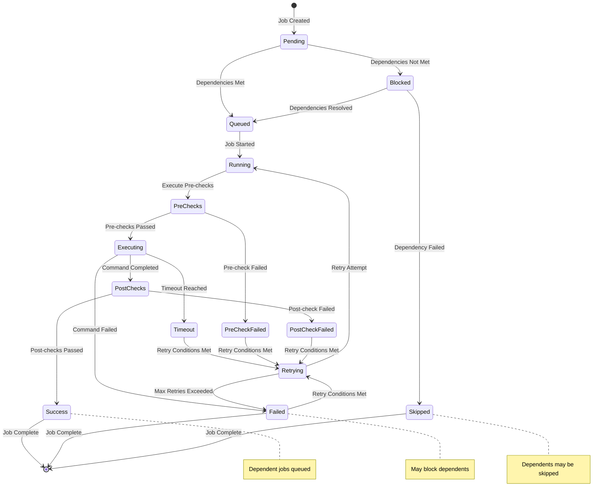
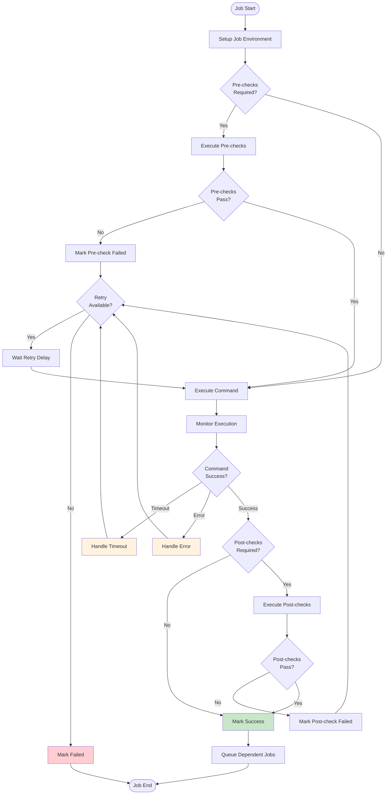
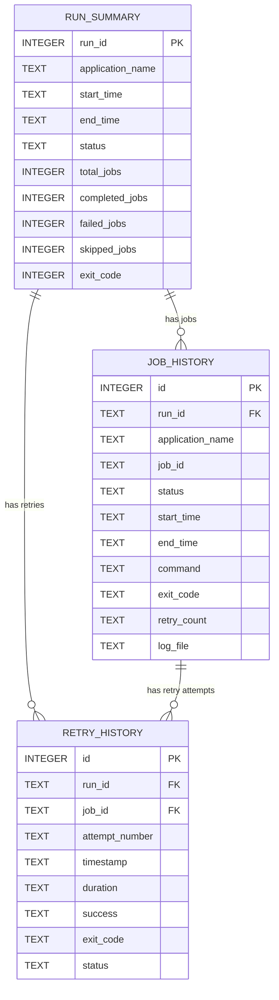
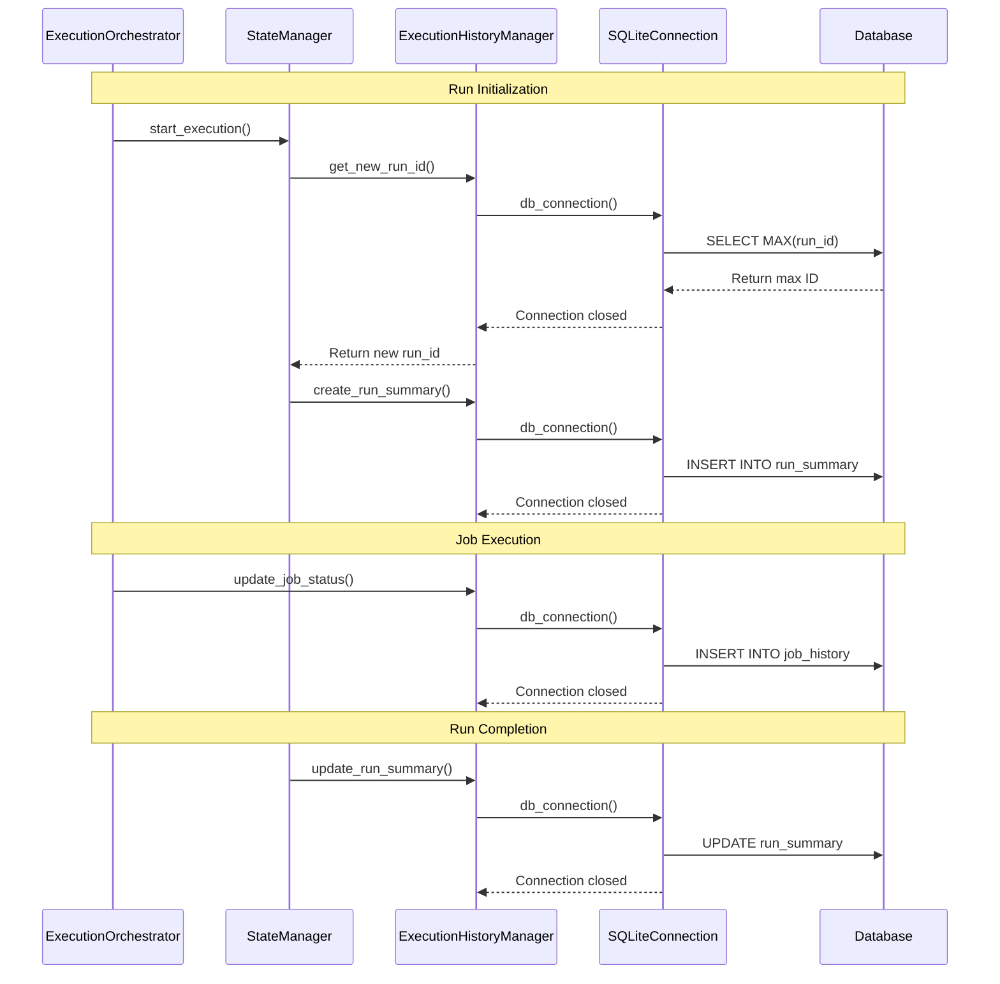
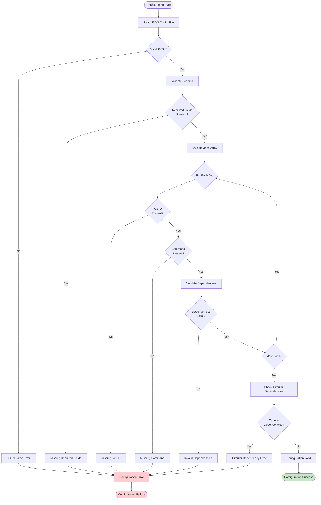

# Executioner Architecture Documentation

## Overview

The Executioner is a sophisticated job execution engine with dependency management, built using a modular, single-responsibility architecture. This document provides comprehensive diagrams and explanations of the system's components and execution flows.

## Table of Contents

1. [System Architecture](#system-architecture)
2. [Component Interactions](#component-interactions)
3. [Execution Flow](#execution-flow)
4. [Job Lifecycle](#job-lifecycle)
5. [Database Schema](#database-schema)
6. [Configuration Flow](#configuration-flow)

---

## System Architecture

### High-Level Component Overview



### Component Relationships



---

## Component Interactions

### Data Flow Between Components



---

## Execution Flow

### Main Execution Process



### Decision Points & Flow Control



---

## Job Lifecycle

### Individual Job Processing



### Job Execution Detail Flow



---

## Database Schema

### Table Relationships



### Data Flow in Database Operations



---

## Configuration Flow

### Configuration Loading and Validation



### Configuration Structure

```mermaid
graph TB
    subgraph "Root Configuration"
        Config[JSON Config File]
        Config --> AppName[application_name]
        Config --> Jobs[jobs[]]
        Config --> Settings[Global Settings]
    end
    
    subgraph "Global Settings"
        Settings --> Parallel[parallel: bool]
        Settings --> MaxWorkers[max_workers: int]
        Settings --> Timeout[default_timeout: int]
        Settings --> Email[email_settings{}]
        Settings --> Env[env_variables{}]
    end
    
    subgraph "Job Configuration"
        Jobs --> Job1[Job Object]
        Job1 --> JobID[id: string]
        Job1 --> JobCmd[command: string]
        Job1 --> JobDeps[dependencies: array]
        Job1 --> JobEnv[env_variables: object]
        Job1 --> JobTimeout[timeout: int]
        Job1 --> JobRetry[retry_settings: object]
        Job1 --> JobChecks[pre/post_checks: array]
    end
    
    subgraph "Validation Rules"
        Rules[Validation Rules]
        Rules --> UniqueIDs[Unique Job IDs]
        Rules --> ValidDeps[Valid Dependencies]
        Rules --> NoCircular[No Circular Dependencies]
        Rules --> ValidCommands[Non-empty Commands]
    end
    
    style Config fill:#e1f5fe
    style Settings fill:#f3e5f5
    style Jobs fill:#e8f5e8
    style Rules fill:#fff3e0
```

---

## Summary

The Executioner architecture follows these key principles:

1. **Single Responsibility**: Each component has a focused, well-defined purpose
2. **Separation of Concerns**: Clear boundaries between configuration, execution, state management, and reporting
3. **Dependency Injection**: Components receive their dependencies, making testing easier
4. **Database Abstraction**: SQLite-specific implementation can be easily extended to other databases
5. **Modular Design**: Components can be independently tested and maintained

### Key Benefits

- **Maintainability**: Clear component boundaries make changes easier
- **Testability**: Each component can be unit tested in isolation
- **Extensibility**: New databases, notification methods, or execution strategies can be added easily
- **Reliability**: Robust error handling and state management
- **Scalability**: Parallel execution and efficient resource management

### Future Extensions

The architecture supports easy addition of:
- New database backends (PostgreSQL, MySQL)
- Additional notification channels (Slack, Teams, webhooks)
- Different execution strategies (distributed execution)
- Enhanced monitoring and metrics
- Configuration templating and inheritance